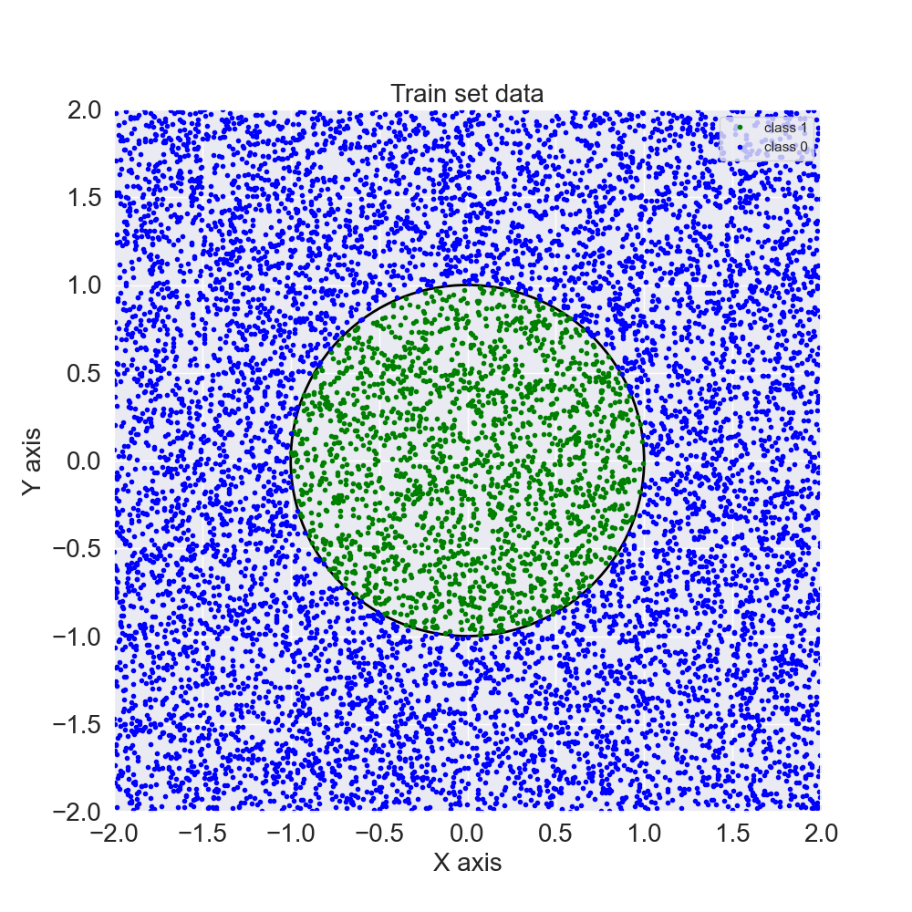
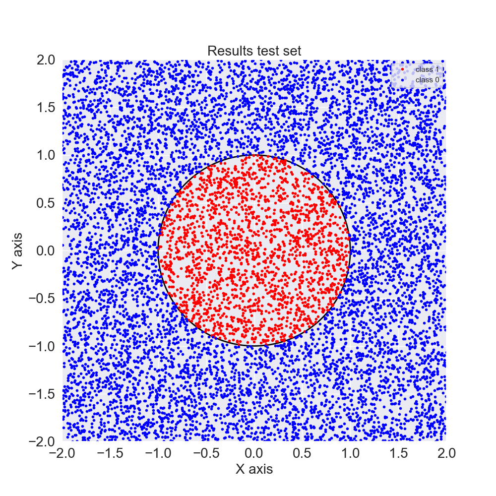

# Neural Network for Predicting Points Inside the Unit Circle

This repository contains code for building and training a neural network using PyTorch to predict whether a point in $\mathbb{R}^2$ is inside the unit circle or not. The model is trained using a dataset of labeled points, where each point is represented as a pair of (x, y) coordinates and labeled as 1 if it's inside the unit circle or 0 if it's outside the unit circle.

The model achieved an accuracy of 99.37% in the test set. 

## Requirements
To run the code in this repository, you'll need the following:

PyTorch (we used version 1.9.0)

NumPy

Matplotlib (optional, for visualizing the results)

Seaborn

## Data

The repository includes a data.py file, which generates a dataset of labeled points. The *GenerateUnitSphere2dDataset* class in this file can be used to generate a new dataset with a specified number of points and a specified radius for the unit circle. The default dataset includes 1000 points with a radius of 1. The train set is represented in the image below:

 
## Model's Architecture and Training:

The model is a FeedForward Neural Network with 1 hidden layer of dimension 128.

$$f(x) = \sigma_2 (W_2 \times \sigma_1(W_1 \times x)) $$

(We avoided the biases $b_1, b_2$ in the equation for simplicity)

Where $\sigma_1$ is a ReLU activation function and $\sigma_2$ is a sigmoid activation.
$W_1 \in \mathbb{R}^{128,2}$ and $W_2 \in \mathbb{R}^{128,2}$ are learnable matrices.

The training had 250 epochs and $lr=0.01$

The results on the test set can be seen in the plot below:

We observe that the only errors are in the border of the circle. 